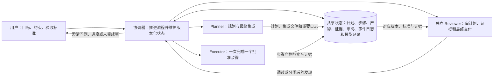
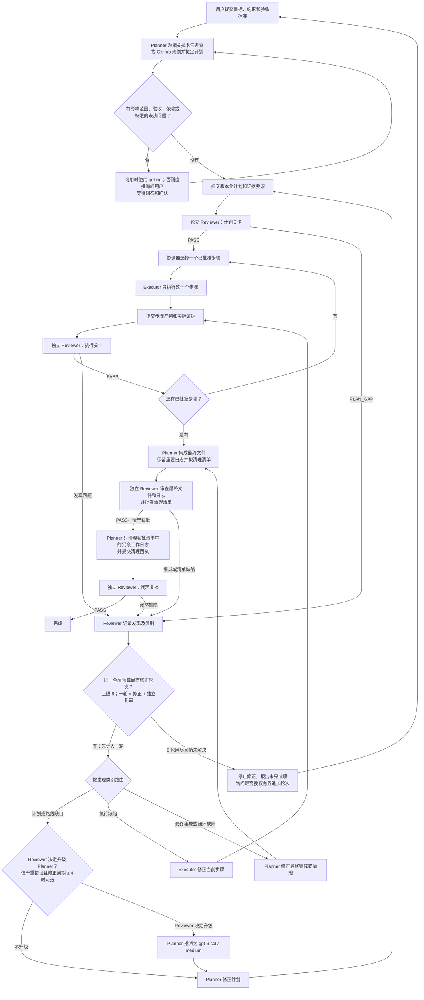

# 闭环子代理

一个由独立审阅把关的多步骤协作 Skill：先审计划，再按批准步骤逐项执行；每项工作都要提交产物和证据，经 Reviewer 通过后才能继续。面向使用者的 README、安装指南和平台说明使用中文；核心 Skill、参考文档和角色模板保留英文。

## 功能一览

| 你需要做什么 | Skill 如何处理 | 你会看到什么 |
|---|---|---|
| 交代目标和完成标准 | Planner 把工作拆成步骤、验收标准、证据要求和风险；相关技术任务会先查找至少 1,000 Stars 的 GitHub 候选，并记录来源、适用性、适配方式和局限。 | 一份可审阅的计划，不会未经批准就开始执行。 |
| 解决关键不确定性 | 若未决问题会影响范围、验收、依赖或权限，Planner 暂停并及时询问；有 `grilling` 技能时可用它组织澄清，否则直接向你提问，并等待答复和确认。 | 不把重要选择当作默认值或猜测。 |
| 逐步完成任务 | 独立 Reviewer 先审计划；通过后，Executor 每次只执行一个已批准步骤，并提交实际产物和证据供 Reviewer 独立复核。 | 每一步都有明确的通过或退回结果。 |
| 处理审阅发现 | `PLAN_GAP` 退回 Planner，`EXECUTION_DEFECT` 退回 Executor；最终集成、日志、清理和闭环发现退回 Planner。**所有发现都先经过同一个全局修正预算。** | 一条可追踪的修正与复审路径，最多 8 轮。 |
| 完成交付和收尾 | Planner 集成最终文件、保留重要日志并提出清理清单；独立 Reviewer 批准清单后，Planner 才清理清单中的日志并提交回执，再由 Reviewer 做闭环复核。 | 最终文件、关键记录和清理证据。 |
| 核对配置和进度 | 版本化共享状态记录计划、步骤、产物、证据、审阅结果和模型信息；模型分配与运行时模型遥测分开记录。 | 能区分“宿主接受了模型分配”和“宿主报告了实际运行模型”。 |

每轮修正由一次纠正和随后一次独立复审组成。8 轮后仍有未解决项时，流程停止、报告剩余问题，并询问是否授权有界追加轮次；未获明确授权和记录前不会继续修正。

## 角色关系



## 工作流与修正路由



Reviewer 对计划、步骤和最终阶段使用各自的独立复审关卡。无论发现来自计划审阅、执行审阅、最终集成、清理清单还是闭环复核，都必须先通过图中的同一个全局 8 轮预算；最终阶段的缺陷不会直接退回 Planner 绕过预算。只有 Reviewer 判定属于严重规划或路线错误、且已进入第 4 个或之后的修正周期时，Reviewer 才可决定将 Planner 指派为 `gpt-6-sol / medium`；该分配不等于运行时模型已核验。

## 平台支持

Skill 文件格式本身不保证宿主提供独立子代理调度、分角色模型设置或运行时模型遥测。下表概述仓库适配范围；请按平台、版本和当前界面确认实际能力。

| 平台 | 支持方式与边界 |
|---|---|
| Codex | 原生 Skill 和宿主子代理调度；本仓库不提供 Codex 角色模板。默认角色配置为 `gpt-6-luna / max`；符合条件时 Reviewer 可决定从第 4 个修正周期起将 Planner 指派为 `gpt-6-sol / medium`。若宿主不提供运行时遥测，只能报告模型分配，不能声称核验了实际运行模型。 |
| Claude Code | 原生 Skill 和自定义子代理；角色模板支持模型与 effort 字段。先确认当前版本提供的模型 ID 和设置。 |
| TraeWork | 支持 Skill 包导入；公开资料未证明当前 Work 界面具备独立子代理调度。需在实际界面确认；不支持时可使用手动审阅桥接，并标记 `MANUAL_REVIEW`。 |
| Qoder CLI | CLI 支持 Skill、自定义子代理及每代理模型 / effort 配置；仓库模板面向 Qoder CLI，不能据此推断 Qoder IDE 或 Quest 使用相同路径和能力。 |
| Cursor | 原生 Skill 和自定义子代理。账号、订阅或组织策略可能导致模型回退；模板提示不能代替宿主级权限限制，需确认 Reviewer 上下文确实独立。 |
| OpenCode | 原生 Skill 和自定义子代理；模型需按当前服务商使用 OpenCode 的 `provider/model` 标识。 |
| WorkBuddy | 支持技能市场或本地技能包导入；是否提供独立子代理、角色模型设置和持久化取决于产品形态与版本。不能独立审阅时，使用手动桥接并标记 `MANUAL_REVIEW`。 |

`MANUAL_REVIEW` 表示 Reviewer 需要在单独上下文中由用户手动运行和传递材料，不能宣称为原生独立子代理审阅。平台支持说明是适配指引，不代表已完成所有宿主版本的运行时兼容认证。

## 安装

先克隆仓库，或从 GitHub 下载 ZIP；然后按平台安装完整的 `skills/closed-loop-subagents/` 目录。仓库附带的原生角色模板仅位于 `adapters/claude-code/agents/`、`adapters/qoder/agents/`（Qoder CLI）、`adapters/cursor/agents/` 和 `adapters/opencode/agents/`。Codex 使用宿主原生子代理调度，本仓库没有 Codex 角色模板；TraeWork 和 WorkBuddy 对应手动桥接文件，本仓库不提供这两者的原生 agent 模板。

```bash
git clone https://github.com/tsf040628-png/closed-loop-subagents.git
```

不要只复制 `SKILL.md`：`references/` 和 `assets/` 中包含所需规则、平台说明和配置样例。逐个平台的安装路径、导入方式和安装后检查见[安装指南](INSTALLATION.md)。首次使用时确认当前平台界面、可用模型和设置；不要把 Codex 的模型标识当作其他平台的配置，也不要把模型分配当作实际运行时遥测。

## 项目文件

- 核心 Skill：`skills/closed-loop-subagents/`
- 平台能力说明：`skills/closed-loop-subagents/references/platform-adapters.md`
- Claude Code 角色模板：`adapters/claude-code/agents/`
- Qoder CLI 角色模板：`adapters/qoder/agents/`
- Cursor 角色模板：`adapters/cursor/agents/`
- OpenCode 角色模板：`adapters/opencode/agents/`
- TraeWork 手动审阅桥接：`adapters/trae-work/manual-review-bridge.md`
- WorkBuddy 手动角色桥接：`adapters/workbuddy/manual-role-bridge.md`
- 安装指南：[INSTALLATION.md](INSTALLATION.md)
- 兼容性检查表：[tests/compatibility-matrix.md](tests/compatibility-matrix.md)

## 上游致谢与许可

本项目参考了 [obra/superpowers 的 subagent-driven-development Skill](https://github.com/obra/superpowers/tree/main/skills/subagent-driven-development) 的流程展示方式，也参考了 [anthropics/skills](https://github.com/anthropics/skills) 的用户导向文档组织方式；本项目没有因此复制上游代码。详情见 [NOTICE.md](NOTICE.md)。本项目使用 MIT License，见 [LICENSE](LICENSE)。

